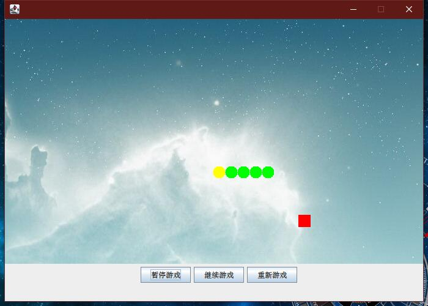

<!--
 * @Author: Weidows
 * @Date: 2020-08-09 19:21:58
 * @LastEditors: Weidows
 * @LastEditTime: 2020-08-09 19:51:59
 * @FilePath: \Weidows\Java\src\main\java\demos\snake_game\README.md
-->
*事先声明作者非本人,此处仅仅是学习借鉴使用*
# 贪吃蛇  

<h2>

  [贪吃蛇小程序](./Java/src/main/java/demos/snake_game/)-所需要的[audio](../../../../../audio/SnakeGame/music.wav)和图片  
<h2>

  

## 需要注意的是这个程序的音频类在JDK9之后被移除了,所以比较高版本的JDK无法正常发声,但亲测程序运行无碍  

# 运行截图
